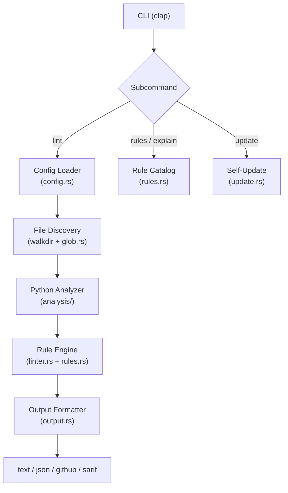

# owui-lint


> The **release** badge above always reflects the latest published GitHub release version automatically.

> **Disclaimer:** `owui-lint` is a hobby project and is **not** developed or maintained by the
> [Open WebUI](https://github.com/open-webui/open-webui) team. Thank you to the Open WebUI
> maintainers for building an amazing platform. The rulesets in this tool are opinionated and
> derived from studying the Open WebUI extension codebase — they are **not** official rules
> endorsed by the Open WebUI project.

`owui-lint` is a Rust CLI linter for Open WebUI extensions:

- `Tools`
- `Pipe`
- `Filter`
- `Action`
- `Pipeline`

## Scope and Limits

- `owui-lint` uses a lightweight Python scanner for basic delimiter/string issues (`OWUI001`).
- It is intentionally **not** a full Python grammar parser.
- For full syntax verification, run `python -m py_compile <file.py>`.
- The primary focus is Open WebUI-specific semantics: extension type structure, Valves/UserValves usage, reserved-args/signature compatibility, and extension hook contracts.

## Architecture

- Native binary distribution (`owui-lint`)
- YAML config for lint rules (`config.yml` or `owui-lint.yml`)



## Install

### Pre-built binaries (recommended)

macOS / Linux:

```bash
curl -fsSL https://raw.githubusercontent.com/christestet/owui-lint/main/scripts/install.sh | sh
```

Windows (PowerShell):

```powershell
irm https://raw.githubusercontent.com/christestet/owui-lint/main/scripts/install.ps1 | iex
```

Or download a binary directly from the [Releases](https://github.com/christestet/owui-lint/releases/latest) page.

### Uninstall

macOS / Linux:

```bash
curl -fsSL https://raw.githubusercontent.com/christestet/owui-lint/main/scripts/uninstall.sh | sh
```

Windows (PowerShell):

```powershell
irm https://raw.githubusercontent.com/christestet/owui-lint/main/scripts/uninstall.ps1 | iex
```

### Build from source

```bash
cargo build --release
./target/release/owui-lint
```

## Docker (No Rust/Cargo Needed)

Build image:

```bash
make docker-build
```

Run linter from Docker against current workspace:

```bash
make docker-run TARGET=.
make docker-run TARGET="path/to/extensions --format json --output report.json"
```

Install binary from Docker image to local `./bin`:

```bash
make docker-install
./bin/owui-lint --help
```

Install to a custom path:

```bash
make docker-install INSTALL_DIR="$HOME/.local/bin"
```

## Usage

<!-- BEGIN:OWUI_LINT_COMMANDS -->
_This section is generated by `src/bin/docs-sync.rs`. Do not edit manually._

### Commands

| Command | Description | Usage |
|------|-------------|-------|
| `owui-lint` | Top-level command | `owui-lint [OPTIONS] [TARGET]... [COMMAND]` |
| `owui-lint lint` | Lint one or more targets | `owui-lint lint [OPTIONS] [TARGET]...` |
| `owui-lint rules` | List all supported lint rules | `owui-lint rules [OPTIONS]` |
| `owui-lint update` | Check for updates and install the latest version | `owui-lint update` |
| `owui-lint explain` | Explain a lint rule (for example: OWT101) | `owui-lint explain [OPTIONS] <RULE_ID>` |

### Global Options

| Option | Description |
|--------|-------------|
| `-c, --config <PATH>` | Path to config file (default lookup: config.yml, owui-lint.yml, owui-lint.yaml). |
| `--format <FORMAT>` | Output format for lint findings. Default: text Possible values: text, json, github, sarif |
| `-o, --output <PATH>` | Write output to a file instead of stdout. |
| `--fail-on <FAIL_ON>` | Exit behavior: none=always 0, error=non-zero on errors, warning=non-zero on any findings. Default: error Possible values: none, error, warning |
| `-h, --help` | Print help (see a summary with '-h') |

### Quick Examples

```bash
owui-lint path/to/extensions
owui-lint path/to/extensions --format sarif --output owui-lint.sarif
owui-lint rules
owui-lint explain OWT101
```
<!-- END:OWUI_LINT_COMMANDS -->

Control exit behavior:

```bash
owui-lint path/to/extensions --fail-on error
owui-lint path/to/extensions --fail-on warning
owui-lint path/to/extensions --fail-on none
```

Exit codes:

- `0`: no configured failure condition met
- `1`: failure condition met (`--fail-on`)
- `2`: usage/configuration/runtime error

Text output includes remediation hints per finding:

```text
path/to/tools.py:10:5: warning OWT101 Tool method 'search' should include a descriptive docstring.
  help: Tool methods should include clear docstrings so users understand capabilities.
  fix: Add a descriptive docstring to each public tool method.
```

## Configuration (`config.yml` or `owui-lint.yml`)

```yaml
lint:
  include:
    - "**/*.py"
  exclude:
    - ".git/**"
    - ".venv/**"
    - "**/__pycache__/**"

rules:
  # values: error | warning | off
  OWUI020: off
  OWT101: error
```

## Rules

Run `owui-lint rules` for the live catalog with current defaults.
Run `owui-lint explain <RULE_ID>` for per-rule details and remediation advice.

<!-- BEGIN:OWUI_LINT_RULES -->
_This section is generated by `src/bin/docs-sync.rs` from `owui-lint rules --format json`. Do not edit manually._

### Universal (all extension types)

| Rule | Severity | Title | What it checks |
|------|----------|-------|----------------|
| `OWUI001` | error | Basic Python scan failed | A lightweight Python delimiter/string scan found an issue. This is not full Python grammar validation. |
| `OWUI010` | warning | No extension class detected | The file looks like an extension, but no Tools/Pipe/Filter/Action/Pipeline class was found. |
| `OWUI011` | error | Mixed extension types | A file contains more than one extension type, which Open WebUI does not support. |
| `OWUI020` | warning | Missing Valves class | Extensions should provide a nested `Valves` or `UserValves` class for runtime configuration. |
| `OWUI021` | warning | Valves should inherit BaseModel | `Valves` and `UserValves` configuration should inherit from `pydantic.BaseModel`. |
| `OWUI022` | warning | Valves not initialized | The extension does not initialize `self.valves` in `__init__` for a declared `Valves` class. |
| `OWUI023` | warning | Sensitive valve field not masked | A `Valves` or `UserValves` field name suggests sensitive data (API key, token, password) but does not use the password input type to mask UI display. |
| `OWUI030` | warning | Missing version in module header | The module docstring header does not include a `version:` field. |
| `OWUI031` | warning | Requirements missing version specifier in module header | One or more packages in `requirements:` have no version specifier. |
| `OWUI032` | warning | Missing title in module header | The module docstring header does not include a `title:` field, which Open WebUI uses as the display name in the UI. |

### Tools (`OWT`)

| Rule | Severity | Title | What it checks |
|------|----------|-------|----------------|
| `OWT100` | error | No public tool methods | Tools extension must expose at least one callable public method. |
| `OWT101` | warning | Tool method missing docstring | Tool methods should include clear docstrings so users understand capabilities. |
| `OWT102` | warning | Tool method should be async | Tool methods should be async; Open WebUI calls them in an async context and type-hints generate JSON schemas for the model. |

### Pipe (`OWP`)

| Rule | Severity | Title | What it checks |
|------|----------|-------|----------------|
| `OWP200` | error | Pipe method missing | Pipe extension must define a `pipe` method. |
| `OWP201` | warning | Pipe has inlet/outlet | Pipe extensions should not define `inlet` or `outlet` methods. |
| `OWP202` | warning | Pipe method should be async | Synchronous `pipe` methods reduce compatibility with Open WebUI runtime execution. |

### Filter (`OWF`)

| Rule | Severity | Title | What it checks |
|------|----------|-------|----------------|
| `OWF300` | error | Filter has no inlet/outlet/stream | Filter extension must implement `inlet`, `outlet`, `stream`, or a combination of them. |
| `OWF301` | warning | inlet should return body | `Filter.inlet` should return the transformed request body. |
| `OWF303` | warning | Filter handler missing required payload parameter | `Filter.inlet`/`Filter.outlet` should declare `body`, and `Filter.stream` should declare `event`, matching Open WebUI keyword injection. |
| `OWF304` | warning | Filter.stream missing event parameter | `Filter.stream` should accept an `event` parameter to receive streamed events from Open WebUI. |

### Action (`OWA`)

| Rule | Severity | Title | What it checks |
|------|----------|-------|----------------|
| `OWA400` | error | Action method missing | Action extension must define an `action` method. |
| `OWA402` | warning | Action.action missing body parameter | `Action.action` should accept a `body` parameter, matching Open WebUI keyword injection. |
| `OWA401` | warning | Action should be async | Synchronous `action` methods may not behave correctly in async execution contexts. |

### Pipeline (`OWPL`)

| Rule | Severity | Title | What it checks |
|------|----------|-------|----------------|
| `OWPL500` | error | Pipeline missing processing hook | Pipeline extension must define `pipe` (pipe type), `pipes` (manifold type), or filter hooks (`inlet`/`outlet`/`stream`). |
| `OWPL501` | warning | Pipeline name not assigned | `Pipeline.__init__` should assign `self.name` for clearer labeling. |
<!-- END:OWUI_LINT_RULES -->

## Rule Severity and Exit Behavior

`owui-lint` separates rule severity from CLI exit behavior:

- Rule severity: `error` or `warning` (default per rule, configurable)
- Exit policy: controlled by `--fail-on` (`none`, `error`, `warning`)

Example:

```yaml
rules:
  OWT101: error # turn warning into error
  OWP202: warning # keep warning
  OWUI020: off # disable rule
```

If a config contains unknown rule IDs, `owui-lint` warns and shows valid discovery commands.

## Contributing Rules

To add a new warning/error rule, see [CONTRIBUTING.md](CONTRIBUTING.md).

High-level flow:

1. Add rule metadata in `src/rules.rs` (including default severity and remediation).
2. Emit findings in `src/linter.rs` using the shared `issue(...)` helper.
3. Add tests in `tests/`.
4. Run `make docker-check` (recommended CI-parity path), or run local Rust checks directly.

Rule scaffold helper:

```bash
./scripts/new-rule.sh OWC600 warning "Missing cache timeout"
```

## SARIF for GitHub Code Scanning

```yaml
- name: Run owui-lint (SARIF)
  run: owui-lint path/to/extensions --format sarif --output owui-lint.sarif

- name: Upload SARIF
  uses: github/codeql-action/upload-sarif@v3
  with:
    sarif_file: owui-lint.sarif
```

## Quality

```bash
make docker-check
```

## License

Check [MIT License](LICENSE)
